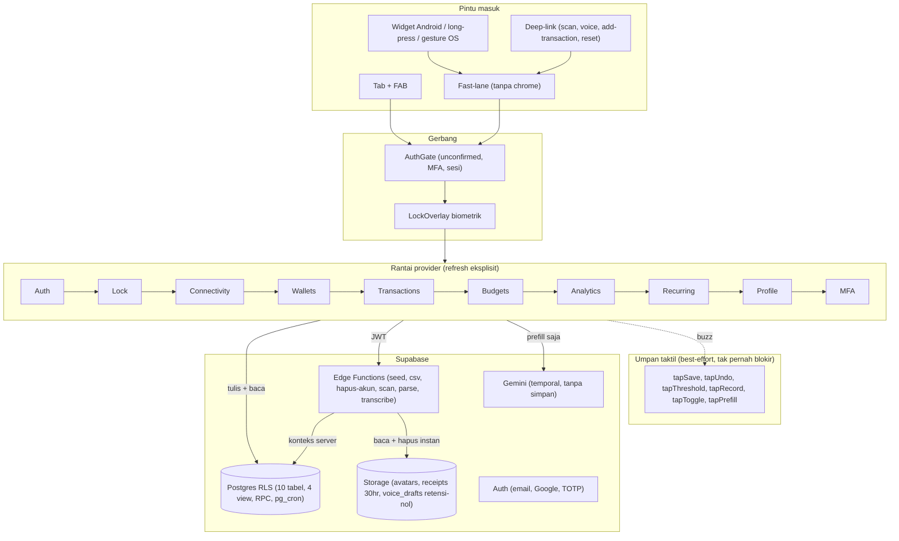

# Cashtrix: Personal Finance, Tenang & Privat

**Cashtrix** adalah aplikasi mobile personal finance (iOS & Android) dengan
estetika *private wealth*, obsidian + champagne gold. Input transaksi di bawah
20 detik (ketik, dikte suara, pindai struk, atau rekam suara), multi-dompet,
transfer antar-dompet, transaksi berulang otomatis, analitik server-side,
budget per kategori dengan alert anti-spam, pencarian riwayat, inbox
notifikasi, dan widget home screen. Saran AI selalu prefill yang wajib
diketuk Simpan manual. Satu pengguna, satu perangkat; semua agregasi
uang dihitung di Postgres, tidak pernah di klien.

> **Status: AI Fase 1 + B1 di `main` (PRD R13).** Di atas v2.0.0: AI server
> prefill-only (AI1 `parse-voice` + AI2 golden 40 + AI3 `scan-receipt`
> Gemini + AI4 wiring form + AI5 legal + AI6 rekam audio
> `transcribe-voice`) + batch haptics B1 (`expo-haptics`, waveform,
> Screen pin); preview build `0c8b2fc2` FINISHED (app 2.0.0 vc 1).
> Sebelumnya: v2.0.0 (tag `v2.0.0`): widget Android + fast-lane
> (WG1 parser split, WG2 widget + notifikasi) + polish (kartu Profile,
> pill Keluar, hero obsidian + eye, 76 ikon, kartu Mata Uang) + fix
> refresh opsi dompet, di atas fondasi v1.2.0. Peta ticket:
> [specs/tickets.md](specs/tickets.md).

**Dokumen perencanaan (mengikat):**

| Dokumen | Isi |
|---|---|
| [PRD.md](PRD.md) | Keputusan produk terkunci (D1–D11), KPI, Epic A–F, AI Fase 1 (§3), risiko, revisi R1–R13 |
| [DESIGN.md](DESIGN.md) | Design system kanonik "Minimalist Obsidian" (sumber kebenaran visual) |
| [specs/cashtrix-mvp.md](specs/cashtrix-mvp.md) | Spec MVP v1.0 |
| [specs/cashtrix-v1.1.md](specs/cashtrix-v1.1.md) | Spec v1.1 (V0–V6) |
| [specs/cashtrix-v1.2.md](specs/cashtrix-v1.2.md) | Spec v1.2 (S1–S3 pintasan + scan, gerbang `1.2.0`) |
| [specs/cashtrix-voice-capture.md](specs/cashtrix-voice-capture.md) | Spec voice capture / Catat Suara (VC1–VC3, device lolos, tanpa bump versi) |
| [specs/tickets.md](specs/tickets.md) | Peta ticket: T1–T11, V0–V6, A3–A6, D4, B4, C6, C2/D5/D3, S1–S3 + RLS, VC1–VC3, WG1–WG3, OB1–OB3, AU1/AU2, AI1–AI6 + B1 |
| [docs/roadmap.md](docs/roadmap.md) | Katalog ide + urutan rilis + keputusan OPEN |
| [docs/adr/](docs/adr/) | ADR-0001..0016 (scope, dev-client, transfer, recurring, legal, lock, i18n, shortcut/scan, voice, widget, outbox, SMTP, OAuth, audio Fase 2, batch haptics) |
| [docs/release-gate.md](docs/release-gate.md) | Gerbang rilis: bukti E2E, KPI, checklist visual, pra-store |
| [docs/store-submit.md](docs/store-submit.md) | Mekanik submit TestFlight / Play Store |
| [CONTEXT.md](CONTEXT.md) | Glosarium + konteks domain |

---

## Daftar isi

- [Fitur](#fitur)
- [Teknologi](#teknologi)
- [Arsitektur & konvensi](#arsitektur--konvensi)
- [Diagram arsitektur](#diagram-arsitektur)
- [Struktur repo](#struktur-repo)
- [Memulai](#memulai)
- [Database](#database)
- [Pengujian](#pengujian)
- [Rilis & distribusi](#rilis--distribusi)
- [Desain](#desain)
- [Keamanan & privasi](#keamanan--privasi)
- [Keputusan penting](#keputusan-penting)
- [Roadmap](#roadmap)

---

## Fitur

### Auth + gate email (Epic A, V0)

- Register email + password dengan validasi inline (format email, ≥8 karakter,
  ≥1 huruf + ≥1 angka); pesan error terpetakan client-side, bukan string server.
- Sesi tanpa `email_confirmed_at` ditahan di layar **Cek email** (bukan tabs),
  dengan tombol kirim ulang; deep link `cashtrix://check-email` menukar kode
  PKCE / hash token sendiri (`detectSessionInUrl: false`).
- **Lupa password**: tautan email Supabase → deep link
  `cashtrix://reset-password`.
- Login pertama pasca-konfirmasi otomatis di-seed 1 dompet **Cash** via Edge
  Function `seed-user` (idempotent); 12 kategori sistem langsung tersedia.
- Sesi persisten, buka ulang app langsung ke Dashboard. Sign out menghapus
  sesi + seluruh storage lokal aplikasi.

### Dompet (Epic B, V4)

- CRUD dompet: nama, tipe (`bank` / `ewallet` / `cash` / `card`), opening
  balance. Maksimal **10 dompet per akun** (trigger).
- Saldo gabungan di Dashboard, selalu dari SQL view, tidak pernah disimpan di
  kolom mutable.
- Hapus dompet berisi transaksi ditolak FK, UI menawarkan **reassign massal**
  ke dompet lain (satu transaksi DB via RPC, termasuk transaksi soft-deleted).
- **Arsip dompet**: `archived_at` menyembunyikan dari Dashboard + semua picker
  tanpa menghapus riwayat; transfer lama ke dompet terarsip tetap bernama.
  Arsip otomatis menjeda rule recurring yang memakai dompet itu.

### Transaksi (Epic C, V2, V4, V5, A3, A4)

- Form <20 detik: segmen Expense / Income / **Transfer**, keyboard numerik
  kustom + live-format `id-ID`, grid kategori sesuai tipe (transfer tanpa
  kategori, `category_id` nullable khusus transfer), **grid kalender `View`**
  (tanpa date picker native), catatan ≤200 karakter, future date ditolak
  (trigger DB, toleransi 1 menit).
- Transfer = satu baris (`wallet_id` sumber + `counterparty_wallet_id`
  tujuan, amount positif); saldo sumber − / tujuan + / gabungan diam;
  analytics & budget mengabaikan transfer.
- Idempotency key (UUID v4 per sesi form), retry jaringan tidak menduplikasi
  (konflik `23505` dianggap sudah tersimpan).
- Hapus = **soft-delete** (retensi 30 hari via `pg_cron`, lalu hard-delete)
  dengan **snackbar "Urungkan" ~10 detik** (`restore_transaction`).
- Riwayat virtualisasi (`SectionList`, grup per hari, sticky divider),
  paging 20/halaman; **pencarian** teks (catatan + kategori + dompet) dengan
  filter jenis + debounce 300ms di layar `/search`.
- **Bulk edit kategori**: mode pilih di layar search (sejenis terkunci,
  transfer dikecualikan), satu UPDATE atomic dengan guard `type` server-side.

### Analytics (Epic D, A6)

- Rentang `1B` / `3B` / `6B` / `1T` / `Semua` + filter per dompet, semua
  diagregasi server dalam **satu round-trip** (`analytics_overview`;
  target p95 <300ms pada 10k transaksi). Klien tidak pernah menjumlahkan
  `amount`.
- KPI header dengan delta % vs periode sebelumnya yang sama panjang (`—` bila
  periode lalu nol). Donut top-8 expense + "Other", bar chart harian/bulanan,
  empty state eksplisit.
- **Ringkasan bulan lalu** di Dashboard (dari `v_monthly_summary`, zero-fill
  bukan lubang), tap menuju Analytics.

### Budget & alert (Epic E, A5)

- Satu budget per kategori expense per bulan (upsert = create = edit),
  bulan dari `profiles.timezone` via fungsi SQL `current_month(tz)`.
- Ring progres `ok` → `warning` (≥80%) → `exceeded` (≥100%), boundary-exact
  antara SQL dan klien.
- Evaluasi threshold selalu membaca ulang server pasca-commit (tidak pernah
  dari cache pra-commit); local push + banner in-app, **dedup per-user**
  (satu alert per budget per bulan per threshold via `ON CONFLICT DO NOTHING`).
- **Inbox notifikasi** (`/notifications`): grup per bulan, tap menandai dibaca
  + menuju Budgets, aksi "tandai semua dibaca"; dot unread di bel Dashboard.

### Transaksi berulang (V3)

- Rule bulanan: jatuh tempo 1–28 atau akhir bulan, `starts_on` wajib,
  `ends_on` opsional, maks **20 rule aktif** (jeda tidak makan kuota).
- **Catch-up RPC** saat app dibuka / foreground: occurrence yang terlewat
  lahir di tanggal jatuh temponya masing-masing (plafon 12 per rule per sesi,
  anti-ganda termasuk soft-delete). Occurrence identik dengan transaksi manual
  (masuk spent, bisa memicu alert). Tanpa server-push di v1.x.

### Catat Suara (VC1–VC3, WG1 split)

- Mic di form Add → panel voice: dikte via mic keyboard OS (STT milik
  Google/Apple, tanpa modul native, B-OTA) atau ketik langsung.
- Parser aturan lokal membaca nominal digit-ID (`25rb`, `30 ribu`,
  `Rp30.000`, `5 juta`); multi-nominal, kata-bilangan, dan transfer ditolak
  jujur. Saran dompet/kategori = preselect, Simpan selalu manual + snackbar.
- **Split (WG1)**: satu ucapan 2–3 klausa sejenis menjadi 2–3 baris preview
  (hapus per baris, klausa gagal kembali sebagai teks mentah); 4+ klausa dan
  campur kind ditolak. Satu ketuk Catat menulis semua baris (idempotency key
  per baris).
- Pintu `cashtrix://voice` + baris panduan di layar Pintasan (tempel ke
  Back Tap / Quick Tap / RegiStar).
- **Rekam audio (AI6, Fase 2)**: tombol rekam di panel voice (hanya bila ada
  user id), consent mikrofon terpisah, cap 15 detik + auto-stop, <1MB.
  Audio diunggah ke area draf privat lalu ditranskripsi server
  (`transcribe-voice`); berkas dihapus seketika (retensi nol, tanpa tabel),
  transkrip tak pernah transit di klien; prefill langsung, Simpan tetap manual.

### AI prefill server (AI1–AI5, R13)

- AI hanya mengusulkan, tidak pernah menyimpan: `parse-voice` (teks dikte
  maks 500 char → JSON), `scan-receipt` Gemini multimodal (`storage_path`
  saja, tanpa byte/base64 klien, tanpa file temp), `transcribe-voice`
  (audio → prefill, hapus objek instan). Gagal model/validasi = `{ok:false}`
  → lanjut manual; hanya `rate_limited`/`quota_exceeded` (402) yang tampil
  beda.
- Kontrak beku + golden set 40 kasus (gate 36/40, hint liar = FAIL mutlak).
  Primer `gemini-3.5-flash-lite`, fallback `gemini-3.8-flash`;
  konteks disuntik server (timezone, kategori visible, dompet aktif); log
  hanya kode (tanpa teks/nominal); confidence scan fixed jujur `0.42`.
- Consent kamera vs mikrofon vs rekam = tiga consent terpisah.
  `occurred_on` hasil scan/AI tidak pernah menyentuh tanggal form (momen
  input pemilik urutan riwayat).

### Umpan taktil (B1)

- Getar best-effort yang tidak pernah throw/memblokir: simpan sukses, snackbar
  Urungkan, batch penembusan threshold, mulai (berat) / berhenti (ringan)
  rekam, prefill AI mendarat (satu tick, hanya bila teraplikasi), toggle
  kunci/MFA. Modul `src/features/haptics/` (lazy-require, degrade sunyi
  sebelum rebuild); getar bukan pengganti bukti visual (snackbar/banner tetap).

### Login Google + email transaksional (AU1/AU2)

- Login/register sekali ketuk via Google (`expo-auth-session`,
  `expo-web-browser`, `expo-crypto`); satu email satu akun; seed pasca-exchange.
- SMTP Resend (`smtp.resend.com:587`, From `noreply@cashtrix.my.id`) +
  template konfirmasi/recovery dwibahasa di `supabase/templates/`.

### Widget + fast-lane (WG2–WG3, rilis 2.0.0, Android)

- Tiga tombol home screen (Catat Suara, Tambah, Pindai) membuka deep-link
  yang sudah ada + `source=widget`, tanpa tab/chrome, tutup sendiri setelah
  simpan. Widget tanpa data, tanpa sesi, tanpa query.
- Simpan dari widget memposting notifikasi lokal (`N transaksi, Total RpX`,
  izin diminta saat save pertama); simpan in-app tetap snackbar.
- Long-press ikon app: Tambah Expense / Tambah Income / Scan Struk /
  Catat Suara. iOS widget ditunda (butuh Team ID + device Apple).

### Dashboard hero obsidian + eye toggle

- Kartu aspect 1.58: chip EMV rakitan + NFC, watermark Cashtrix, kicker +
  eye, nominal JetBrains Mono, meta dompet, divider + nama pemegang.
- Background gradasi metal 4-stop + sheen gold bolak-balik (mati saat
  reduce-motion) + glow tepi (gold penuh hanya di iOS).
- Eye menyembunyikan nominal (`Rp ••••••`), pilihan menetap per perangkat
  (tidak ikut hapus saat keluar).

### Profile & data milik pengguna (Epic F, T8, T9)

- Kartu per bagian: identitas (avatar + nama + editor + ubah foto), mata uang
  (sumur ringkasan + chips bersimbol), keamanan (kunci + 2FA), pengaturan
  (baris tanpa bingkai, Hapus Akun terakhir aksen merah), pill Keluar danger
  full-width di bawah.
- Nama (≤60 char), avatar (≤2MB PNG/JPG, resize 512×512 sebelum upload ke
  bucket privat, tampil via signed URL), currency display (default `IDR`,
  tanpa konversi).
- Kategori kustom (nama + ikon katalog 76 ikon, ≤40 char); kategori sistem
  hanya bisa disembunyikan (mute) per-user via `category_mutes`, histori tetap
  valid.
- **Ekspor CSV** via share sheet (transfer = satu baris `type=transfer`,
  kategori `Transfer ke {tujuan}`). **Hapus akun** dua langkah (ketik `HAPUS`)
  via Edge Function, menghapus seluruh data + avatar + auth user.

### Kunci aplikasi biometrik (B4)

- Opt-in via toggle Profile (section Keamanan): flag lokal per perangkat,
  tanpa state server, tanpa secret tersimpan (fallback passcode OS).
- Cold start selalu terkunci bila aktif; relock saat kembali dari background
  setelah grace 60 detik. Overlay penuh menutup saldo/nama/nominal.
- Lock bukan sign-out: sesi Supabase persist; sign-out menghapus flag.
- Perangkat tanpa biometrik terdaftar = toggle disabled + pesan.

### 2FA TOTP (C2)

- Opt-in via Profile: enroll satu faktor TOTP (tautan `otpauth://` + secret
  manual, tanpa gambar QR), verifikasi 6 digit.
- Login dengan 2FA aktif: password → layar challenge → tabs. Batal = sign-out
  (sesi setengah jalan tidak dibiarkan linger).
- Unenroll via konfirmasi dari Profile. Recovery = reset password via email
  (tanpa backup code/SMS).

### Rate limiting Edge Functions (D5)

- Counter per user per fungsi di tabel `function_rate_limits` (fixed window
  60 detik): seed-user 10, export-csv 5, delete-account 3, scan-receipt 5,
  parse-voice 5, transcribe-voice 5.
- Tanpa JWT = 401 sebelum rate check; limit tercapai = 429 + `Retry-After`.
- Fail-open: gangguan guard tidak pernah membrick login.

### Ketahanan & status (D4)

- Banner offline in-flow (NetInfo) + **refresh otomatis** semua data +
  catch-up saat koneksi kembali, tanpa memblokir app open.
- `ErrorStateCard` seragam dengan retry di 6 permukaan: Analytics, Budgets,
  Search, Notifikasi, section Dompet & Riwayat Dashboard.

### Observabilitas (T10)

- Event minimal `screen_view`, `tx_created`, `budget_threshold_reached`
  (fakta kasar saja, tanpa amount/note, PRD §4.4).
- **Sentry nyata** via `configureTransport` yang di-inject (crash-free ≥99,5%),
  scrubbing rekursif field finansial sebelum keluar perangkat.

---

## Teknologi

| Lapisan | Pilihan |
|---|---|
| App | React Native 0.86.3 + Expo SDK 57, Expo Router (auth group + 4 tab + FAB) |
| Bahasa | TypeScript strict (`tsc --noEmit`), React 19 |
| Backend | Supabase (project `Cashtrix`, `ap-southeast-2`): Postgres + Auth + RLS + Storage + Edge Functions |
| State server | Context per fitur di atas satu Supabase client (`src/supabase/`) + refresh eksplisit (tanpa Realtime, tanpa TanStack/RTK) |
| Chart | `View` polos (donut = ring tick terotasi, bar = kolom gradient, ring budget = 48 tick), tanpa `react-native-svg` |
| Notifikasi | `expo-notifications` (local push), izin on-demand |
| Konektivitas | `@react-native-community/netinfo` (modul native, berimplikasi rebuild, lihat [Rilis](#rilis--distribusi)) |
| Crash reporting | `@sentry/react-native` via transport injeksi |
| Media | `expo-image-picker` + `expo-image-manipulator` (avatar/struk; modul Expo Go) |
| Audio | `expo-audio` (rekam suara, modul native — butuh rebuild) |
| Haptics | `expo-haptics` (getar best-effort, modul native — butuh rebuild) |
| OAuth | `expo-auth-session` + `expo-web-browser` + `expo-crypto` (login Google) |
| Widget | Plugin config hand-rolled (`plugins/`, tanpa dep runtime, Android-only) |
| Unit test | Jest (preset `jest-expo`), fungsi domain murni |
| DB test | pgTAP (`supabase/tests/database/`, 18 file, 403 assertion) |
| E2E | Maestro (`happy-path` + `smoke` + `voice` + `widget`) + cermin API `verify-t11` |
| CI | GitHub Actions, `release-gate.yml` (lint → typecheck → Jest → kontrak statis → export → `verify-legal`; matriks live saat push `main`) |
| Distribusi | EAS (profil `development` / `preview` / `production`), `expo-dev-client`, OTA `expo-updates` (`runtimeVersion: appVersion`) |

**Keputusan terkunci (PRD §0, D1–D11):** React Native + Expo, Supabase, manual
entry, single currency display (skema siap multi), personal maks 10 dompet,
budget per kategori reset tiap tanggal 1, alert in-app + local push, warna &
font dari `DESIGN.md`, bukan dari layar Stitch.

---

## Arsitektur & konvensi

- **Auth gate tunggal** (`app/_layout.tsx`): memulihkan sesi sebelum first
  paint (splash ditahan), satu-satunya tempat yang navigasi atas state auth.
- **Rantai provider** (luar → dalam: Auth → Lock → Connectivity →
  Wallets → Transactions → Budgets → Analytics → Recurring → Profile →
  Mfa), dibungkus `DataProviders` dengan
  `key={user.id}` sehingga tiap login me-remount dan fetch segar; refresh
  berpasangan memakai ulang promise in-flight (tanpa query ganda).
- **15 modul fitur** = `domain.ts` (murni, seam Jest) + `api.ts` (Supabase)
  + `*-context.tsx` + `components/`. Modul: `auth`, `wallets`,
  `transactions`, `analytics`, `budgets`, `profile`, `recurring`, `voice`,
  `receipts`, `lock`, `mfa`, `haptics`, `connectivity`, `data-ownership`,
  `observability`.
- **Aturan yang mudah dilanggar (PRD §4):** tidak ada kolom saldo mutable;
  semua agregasi finansial di Postgres; bulan budget dari timezone user;
  RLS 100% tabel deny-by-default; dedup alert via unique constraint.
- **Tanpa `setState` di effect** untuk sinkronisasi form (lint
  `react-hooks/set-state-in-effect`); derivasi saat render
  (`override ?? preferensi ?? baris termuat ?? opsi pertama`).
- **TestID statis** untuk kontrak Maestro (`verify-t11 --static-only`);
  rute baru wajib `expo start` sekali untuk regen router types.
- **Hex literal hanya di `src/theme/theme.ts`** (lint
  `no-restricted-syntax`); komponen mengonsumsi via alias `@/theme`
  (`@/*` → `src/*` di tsconfig + jest).

---

## Diagram arsitektur



Catatan: diagram Mermaid (dirender GitHub) dipakai di sini; PRD §4.1
tetap memakai ASCII sebagai konvensi dokumen perencanaan.

## Struktur repo

```
Cashtrix/
├── app/                        # Expo Router (28 rute)
│   ├── _layout.tsx             #   auth gate + LockOverlay + DataProviders
│   ├── (auth)/_layout.tsx      #   login, register, check-email,
│   │                           #   forgot/reset-password, mfa-challenge
│   ├── (tabs)/                 #   index (Dashboard), analytics, budgets,
│   │                           #   profile (+ _layout tab)
│   ├── add-transaction.tsx     #   form transaksi (create + edit ?id=)
│   ├── search.tsx              #   cari + filter + bulk edit kategori
│   ├── notifications.tsx       #   inbox alert budget
│   ├── recurring(.tsx|-form)   #   rule berulang + form
│   ├── budget-form.tsx wallets.tsx wallet-form.tsx
│   ├── categories.tsx category-form.tsx
│   ├── scan.tsx                #   alias → /add-transaction?scan=1
│   ├── voice.tsx               #   alias → /add-transaction?voice=1
│   ├── shortcuts.tsx           #   panduan pintasan OS (ID/EN)
│   ├── mfa-enroll.tsx          #   enroll TOTP (modal)
│   └── delete-account.tsx      #   hapus akun (gerbang ketik HAPUS)
├── src/
│   ├── features/               # 15 modul (domain + api + context + components)
│   │   ├── auth/               #   validation, api, auth-context, deep-link
│   │   ├── wallets/            #   domain, api, context, total-balance-card…
│   │   ├── transactions/       #   domain, api, context, calendar-grid,
│   │   │                       #   undo-snackbar, history-list, search-kind…
│   │   ├── analytics/          #   domain, api, context, donut/bar/kpi,
│   │   │                       #   monthly-summary-card
│   │   ├── budgets/            #   domain, api, context, budget-ring,
│   │   │                       #   notifications.ts
│   │   ├── profile/            #   domain, api, context
│   │   ├── recurring/          #   domain, api, context
│   │   ├── voice/              #   domain, api, voice-sheet, voice-waveform
│   │   ├── receipts/           #   scan.ts, api, receipt-attachment
│   │   ├── lock/               #   domain, api, context, lock-overlay
│   │   ├── mfa/                #   domain, api, context
│   │   ├── haptics/            #   domain, api (6 tap best-effort)
│   │   ├── connectivity/       #   domain, context, offline-banner,
│   │   │                       #   reconnect-refresh
│   │   ├── data-ownership/     #   export CSV, share
│   │   └── observability/      #   sink event, transport Sentry
│   ├── components/             # bersama: Screen, Card, Button, Skeleton,
│   │                           # ErrorStateCard, pressed.ts, …
│   ├── theme/                  # theme.ts = satu-satunya tempat hex
│   ├── i18n/                   # kamus id/en + locale + mapping kategori
│   ├── fonts/                  # loader font app
│   └── supabase/               # client tunggal (persist AsyncStorage)
├── plugins/                    # config plugin hand-rolled (tanpa dep runtime)
│   ├── with-app-widget.ts      #   widget Android (RemoteViews)
│   └── with-app-shortcuts.ts   #   long-press icon (termasuk voice)
├── supabase/
│   ├── migrations/             # 14 migrasi (kanonis, jangan divergen)
│   ├── functions/              # seed-user, export-csv, delete-account,
│   │                           # scan-receipt, parse-voice, transcribe-voice
│   │                           # (+ _shared/rate-limit.ts)
│   ├── templates/              # template email konfirmasi/recovery (ID)
│   └── tests/database/         # pgTAP 00_setup + 01–18
├── __tests__/                 # 51 suite Jest (hapus .session-seed.json bila stale)
│   ├── mocks/                  #   stand-in modul native
│   └── fixtures/               #   golden set AI (voice + receipt)
├── scripts/                    # verify-t5..t9, verify-t11, verify-v2/v3/v4,
│                               # verify-a5/d5/s2/s3/ai-voice/ai6/legal,
│                               # provision-e2e, seed-bulk, lib/admin-confirm
├── .maestro/flows/            # happy-path.yaml, smoke.yaml, voice.yaml,
│                               # widget.yaml
├── .github/workflows/          # release-gate.yml (+ pages.yml legal)
├── docs/                       # roadmap, release-gate, store-submit, adr/
│                               # (0001–0016), legal/ (EN/ID), agents/
└── specs/                      # cashtrix-mvp.md, cashtrix-v1.1.md,
                                # cashtrix-v1.2.md, cashtrix-v2.0-widget.md,
                                # cashtrix-v2.x-outbox.md,
                                # cashtrix-voice-capture.md, tickets.md
```

`ios/` dan `android/` tidak di-commit (generated, Expo managed).

---

## Memulai

### Prasyarat

- Node 22, npm
- Expo Go (loop JS harian) atau dev/preview build (fitur native:
  NetInfo, biometric, locale, audio, haptics)
- Project Supabase hosted `Cashtrix` untuk verifikasi live
- Docker/Podman, hanya untuk `npm run db:test` (alternatif: `psql` langsung
  per AGENTS.md)

### 1. Install & env

```sh
npm install   # biasa saja, JANGAN npx expo install (gagal EALLOWSCRIPTS di repo ini);
              # versi modul native mengikuti node_modules/expo/bundledNativeModules.json
cp .env.example .env   # isi EXPO_PUBLIC_SUPABASE_ANON_KEY (publishable key,
                       # aman di bundle: RLS yang menjaga)
```

> Service role key **tidak pernah** masuk bundle atau repo, hanya via env
> sekali pakai untuk skrip verifikasi, lalu unset + verifikasi bersih.

### 2. Database

Sumber kanonis: `supabase/migrations/*.sql`. Terapkan via:

```sh
supabase db push --linked
```

atau `apply_migration` dengan isi file identik (jangan divergen).

### 3. Jalan

```sh
npm run ios        # / android / start
npx expo export --platform android --output-dir /tmp/out   # bundle check tanpa device
```

### Perintah

| Perintah | Fungsi |
|---|---|
| `npm run lint` | ESLint (termasuk larangan hex di luar `theme.ts`) |
| `npm run typecheck` | `tsc --noEmit`, 0 error |
| `npm run test` | Jest, hapus `__tests__/.session-seed.json` dulu bila stale (untracked, jangan commit) |
| `npm run db:test` | pgTAP, butuh Docker; alternatif `psql` per AGENTS.md |
| `npm run e2e:check` | Kontrak statis selektor Maestro (tanpa device, jalan di CI) |
| `npm run e2e:verify` | Mirror API-level happy path (self-cleanup user uji) |

---

## Database

**10 tabel:** `profiles` (id = auth.uid, timezone `Asia/Jakarta`, currency
`IDR`, locale `id-ID`), `wallets` (enum `bank/ewallet/cash/card`,
`unique(user_id, name)`, batas 10 via trigger, `archived_at`), `categories`
(`user_id` nullable = kategori sistem; `kind` income/expense), `transactions`
(`amount > 0`, `type` income/expense/transfer, `category_id` nullable khusus
transfer, `counterparty_wallet_id`, note ≤200 char,
`unique(user_id, idempotency_key)`, soft-delete `deleted_at`,
`recurring_rule_id` + `occurred_on`), `budgets`
(`unique(user_id, category_id, month)`), `budget_alerts`
(`unique(user_id, category_id, month, threshold)`, dedup **per-user**,
plus `read_at` nullable untuk inbox), `category_mutes` (sembunyikan
per-user atas kategori sistem), `recurring_rules` (due 1–28 / akhir bulan,
`starts_on` wajib, `ends_on` opsional, maks 20 aktif via trigger),
`transaction_receipts` (`transaction_id` nullable = foto pra-save, retensi
30 hari), `function_rate_limits` (counter fixed-window per fungsi per user).

**4 view** (semua `security_invoker = true`, `revoke` dari `anon`/`public`,
`grant select` ke `authenticated`): `v_wallet_balances`,
`v_transactions_feed`, `v_monthly_summary`, `v_budget_status`.

**RPC yang dipanggil klien:** `reassign_wallet_transactions` (bulk-move
atomik, termasuk soft-deleted; collapse sumber=tujuan ditolak),
`soft_delete_transaction` / `restore_transaction` (mengembalikan jumlah
baris, 0 = bukan milik/tidak ada), `purge_deleted_transactions` (job
`pg_cron` harian 03:00 UTC; sebagai `postgres` membersihkan semua user,
sebagai `authenticated` terbatasi RLS), `current_month(tz)`,
`v_category_breakdown`, `v_analytics_series`, `analytics_overview`
(satu round-trip seluruh layar Analytics; `delta.*` null saat periode lalu
nol), `run_recurring_catchup` (plafon 12/rule/sesi, `ON CONFLICT DO NOTHING`).

**RLS:** deny-by-default di 100% tabel (tanpa `USING (true)`; `anon`
dicabut) + 8 policy `storage.objects` untuk 3 bucket privat (`avatars`,
`receipts` 2MB + retensi 30 hari, `voice_drafts` objek-only retensi-nol;
PNG/JPG, audio <1MB). Hardening: FK komposit
`transactions(wallet_id, user_id) → wallets(id, user_id)` dan pasangan
counterparty-nya; trigger `enforce_transaction_no_future` (23514).

**Edge Functions** (deploy tanpa Docker:
`npx supabase functions deploy <nama> --use-api`; `verify_jwt` tetap aktif;
`user_id` selalu dari JWT, tidak pernah dari body; tiap direktori fungsi
wajib `deno.json` sendiri): `seed-user`
(idempotent), `export-csv`, `delete-account`, `scan-receipt`, `parse-voice`,
`transcribe-voice` (ketiganya: rate-limit 5/mnt/user → konteks server →
Gemini → validasi strict → prefill, tanpa tulis transaksi).

---

## Pengujian

Empat lapis; setiap ticket menjalankan ulang seluruh suite (tanpa regresi):

| Lapis | Tool | Cakupan | Status |
|---|---|---|---|
| Unit domain | Jest, 51 suite | Format id-ID, validasi amount, threshold 79.9/80/99.9/100, boundary bulan tz, dedup alert, kalender, search, bulk, undo-window, reload pasca-login, tone warna, konektivitas, recurring, inbox, haptics, waveform, voice/record, AI (parse/validasi/wiring/golden/transcribe) | **807/807 hijau** |
| Unit RLS/SQL | pgTAP, 18 file | Isolasi antar-user semua tabel, constraint, limit 10 wallet, storage, trigger profil, kategori sistem, saldo, reassign, transaksi, analytics, budget, mutes, transfer, recurring, arsip, alert-read, rate-limit, receipts | **403 assertion hijau** |
| Live per fitur | `scripts/verify-*.mjs` | Alur nyata via anon client + Admin API (`provisionTestUser`): T5/T6/T7/T8/T9, transfer (V2), recurring (V3), arsip+undo (V4), inbox (A5), rate-limit (D5), lampiran (S2), OCR (S3), AI voice (AI1), audio (AI6), legal (AI5), kontrak statis + mirror E2E (T11) | Hijau, self-cleanup |
| E2E device | Maestro | Login → 3 txn + alert → transfer → rule + catch-up → hapus + urungkan (`happy-path`); `smoke` read-only; `voice` (dikte + split); `widget` (3 pintu) | Manual per gerbang |

Konvensi: skrip live butuh `SUPABASE_SERVICE_ROLE_KEY` via env sekali pakai
(konfirmasi email aktif di hosted membuat signup anon domain `.test`
ditolak, provisioning hanya via Admin API); user uji dibersihkan
(`delete from auth.users where email like …`), residu diverifikasi 0.
Uji scroll massal via `scripts/seed-bulk.mjs` (200 txn, cleanup `--cleanup`).
Akun E2E persisten via `scripts/provision-e2e.mjs` (selalu jalur login).

---

## Rilis & distribusi

Detail penuh: [docs/release-gate.md](docs/release-gate.md). Per rilis wajib:
Maestro hijau → event KPI (`screen_view`, `tx_created`,
`budget_threshold_reached`) → checklist visual → tanpa regresi → crash-free
tercatat → tag (`v1.0.0` di `492a117`, `v1.1.0` di HEAD gerbang, `v2.0.0`
di commit bump WG3).

- **EAS**: 3 profil (`development` / `preview` / `production`); kerja JS
  harian tetap di Expo Go, dev-client untuk fitur native.
- **OTA** (`expo-updates`, `runtimeVersion: appVersion`): update JS mengalir
  tanpa rebuild, **kecuali tiap modul native baru** (fingerprint mismatch →
  update ditolak diam-diam, tanpa crash). Contoh: rebuild gabungan tunggal
  untuk `expo-audio` (AI6) + `expo-haptics` (B1) → preview build `0c8b2fc2`
  (app 2.0.0 vc 1).
- **CI** (`release-gate.yml`): lint → typecheck → Jest → `e2e:check` →
  `expo export` → `verify-legal`; matriks live penuh
  (`verify-t5/t6/t7/t8/t9/v2/v3/v4/t11` + `a5`/`d5` + `s2`/`s3` +
  `ai-voice`/`ai6`) saat push `main` dengan 2 secret, self-cleanup.
- **Sebelum TestFlight / Play Store** (`docs/store-submit.md`): kembalikan
  `auth.email.enable_confirmations` ke manual (hosted masih auto-confirm
  untuk dev); jangan `supabase config push` dari repo root (pakai workdir
  minimal per properti); bersihkan akun uji.

---

## Desain

Sumber kebenaran visual adalah [DESIGN.md](DESIGN.md) ("Minimalist
Obsidian"), Stitch hanya referensi **layout**.

- Kanvas `#0A0A0A`, card `#1C1C1E`, elevated/border `#2C2C2E` /
  `#3A3A3C`, aksen gold `#D4AF37` (+ soft `#F3E5AB`), teks `#E5E5E5` /
  `#8E8E93`, error `#FFB4AB` (destruktif saja).
- Inter untuk struktural, **JetBrains Mono untuk semua nilai moneter**
  (diimpor per-weight, bukan root paket).
- Semantik nominal: income `#30D158`, expense `#FF6B62`, net gold, Total
  Saldo putih; persen ring budget bukan nominal, tetap putih.
- Spacing skala 4px, margin 20px, clearance nav ≥96px; radius 16/20/24/32/9999;
  button 52px, tap target min 44px; floating nav frosted + FAB 56px gradient gold.
- Divider hairline `colors.border`: Dashboard (ringkasan–Riwayat) + tiap grup
  hari kecuali pertama.
- **Hex literal hanya di `src/theme/theme.ts`**, ditegakkan lint;
  komponen mengonsumsi via alias `@/theme`.
- Drift Stitch yang diketahui (diabaikan): abu M3 `#131313`/`#1C1B1B`
  (API Stitch menurunkan token dari seed) dan Public Sans pada token currency.

---

## Keamanan & privasi

- RLS deny-by-default di 100% tabel + bucket avatar privat; `anon` dicabut;
  view agregasi `security_invoker` + grant minimal (tanpanya saldo user lain
  bocor, ditangkap pgTAP).
- Service role key hanya di Edge Functions / env sekali pakai. HTTPS wajib.
- **Tanpa data finansial di log**, client maupun server; scrubbing
  `amount`/`note` di sink observability + transport Sentry.
- Idempotency key per transaksi mencegah duplikasi saat retry.
- Hak pengguna: ekspor CSV (portabilitas) + hapus akun total (penghapusan).
- App lock biometric device-local (B4, #50): flag lokal, tanpa state server,
  ganti perangkat = opt-in ulang.
- Halaman privasi/ToS (EN + ID) di GitHub Pages, URL sama untuk in-app dan
  store listing; mencakup AI Fase 1 (teks/gambar temporal) + Fase 2
  (rekaman audio retensi-nol), consent kamera/mikrofon/rekam terpisah.
- Gemini = prosesor temporal (tanpa simpan prompt/respons); log hanya kode.

---

## Keputusan penting

Penuhnya di PRD §6.1 dan [docs/adr/](docs/adr/); yang paling memengaruhi kode:

- **R1**, Dedup `budget_alerts` per-user (kunci lama menabrak antar-user
  pada kategori sistem bersama).
- **R2**, `seed-user` hanya membuat dompet Cash; kategori default tidak
  dikopi per-user. Email auto-confirm selama dev.
- **R3/R4**, View saldo `security_invoker` + revoke anon; reassign via RPC
  atomik; `amount` selalu positif, arah dari `type`.
- **R5**, Riwayat hanya dari `v_transactions_feed`; hapus/pulih via RPC
  berperilaku hitung-baris; retensi 30 hari via `pg_cron`.
- **R6**, Scope v1.1 dibekukan (distribusi + transfer + recurring +
  kalender + undo + arsip); outbox offline & read cache ditunda ke v2.0.
- **R7/R8**, Transfer = satu baris tanpa kategori; recurring = catch-up RPC
  bulanan (bukan cron/pengingat); privasi di Pages; reset via deep link.
- **R9**, App lock device-local, grace 60 dtk, cold start selalu kunci
  (ADR-0007, menutup OPEN-3).
- **R10**, i18n ikut locale OS + kamus terpusat, satu pass termasuk legal
  ID (ADR-0008).
- **R11**, Payung v2.x berurutan, tiap rilis gate sendiri; TanStack gugur;
  multi-currency parkir OPEN-4.
- **R12**, Rilis 2.0.0: widget + fast-lane + polish batch (tag `v2.0.0`);
  widget Android hand-rolled, iOS tunda; tanpa label AI; tanpa angka fiktif.
- **R13**, AI Fase 1 + batch B1: `parse-voice` + golden 40 + `scan-receipt`
  Gemini + wiring form + legal v2.0.0 + `transcribe-voice` + haptics
  (satu rebuild `0c8b2fc2`); prefill-only, disiplin Rp 0.
- Pola yang hanya boleh dilanggar dengan revisi PRD dulu: D1–D11.

---

## Roadmap

Katalog lengkap hidup di **[docs/roadmap.md](docs/roadmap.md)**.

- **v1.1.0** ✅, V0 auth/legal + EAS/Sentry + transfer + recurring +
  kalender + undo + arsip (tag di HEAD gerbang).
- **v1.1.x** ✅, transfer di CSV (Opsi B); email dukungan terisi; run
  Maestro device GREEN 2026-09-25.
- **Pasca-1.1.0** ✅ selesai penuh, A6 (#45) → A3 (#46) → A4 (#47) → A5 (#48) →
  D4 (#49) → B4 (#50) → C6 (#51) → C2 (#53) → D5 (#54) → D3 (#52, tetap manual) +
  skeleton/preloader + Maestro device GREEN 2026-09-25.
- **v1.2.0** ✅, S1 pintasan deep-link → S2 lampiran 30 hari → S3 OCR
  prefill (mock-first) → RLS gerbang + bump minor + polish final UI/UX +
  screenshot HP + dokumen legal v1.2 (tag `v1.2.0`, #58 closed 2026-09-27).
- **Pasca-1.2.0** ✅ Catat Suara, VC1 parser + domain murni (#63) → VC2 sheet +
  dikte keyboard OS (#64) → VC3 pintu `cashtrix://voice` + panduan (#65),
  device lolos 2026-09-27 (spec #62 closed, tanpa bump versi).
- **v2.0.0** ✅ rilis 2026-09-29 (tag `v2.0.0`): widget + fast-lane
  (WG1 parser split → WG2 widget native + fast-lane → WG3 gerbang + bump
  `2.0.0`).
- **AI Fase 1 + B1** ✅ di `main` (PRD R13): AI1 `parse-voice` → AI2 golden
  40 → AI3 `scan-receipt` Gemini → AI4 wiring form → AI5 legal v2.0.0 →
  AI6 rekam audio `transcribe-voice` + B1 haptics/waveform/Screen pin
  (satu rebuild `0c8b2fc2` FINISHED).
- **Berikutnya:** device re-gate → 2.1.0 Analytics Overhaul → OB1–OB3
  outbox + read cache paket utuh (spec sync mencakup
  `transaction_receipts` sebagai tipe antrean), lalu bank sync,
  multi-currency (parkir OPEN-4, mungkin IDR-saja) + kurs, AI insight.

Prinsip urutan (§6.4): menutup lubang > menambah permukaan; fondasi ada >
butuh keputusan (grill dulu, pola ADR); satu pass lintas-layar dikerjakan
sekaligus.

---

*Cashtrix, Tenang, cepat, privat. Melihat posisi keuangan dalam hitungan detik.*
